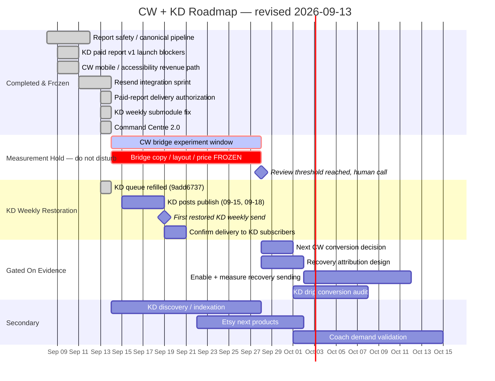

# CW + KD Project Control File
**Projects:** Carnivore Weekly (CW) + KetoDial (KD)  
**Owner:** Brew / Banana Stand Media  
**Purpose:** Single starting point for future ChatGPT / Claude Code conversations  
**Last consolidated:** 2026-09-13  
**Main SHA at consolidation:** `9add67378ae99e24d12ac3c3620a5cdd8d1b53a2`  
**Command Centre 2.0 merge:** `559583c72d16f9b7bfe5acc3823b4f0f12c6b39c`  
**Status rule:** Never treat "audited", "candidate", "tested", or "verified" as "deployed" unless production deployment is explicitly confirmed.  
**Reading order:** §4A is the most recent proven state and overrides any older text in this file that contradicts it.

---

# 1. How to Use This File

Start every new CW/KD planning, implementation, audit, or idea conversation by reading this file first.

Before proposing work:

1. Check whether the idea is already **DONE**, **DEPLOYED**, **IN FLIGHT**, **BLOCKED**, **CANDIDATE / NOT DEPLOYED**, or **BACKLOG**.
2. Identify which current workstream it belongs to.
3. Confirm whether it conflicts with an active release gate or experiment.
4. Avoid reopening frozen work unless new evidence shows a regression.
5. If implementation is required, use the existing Claude Code agents / repo rules rather than recreating brand or safety logic from scratch.
6. Log the result back into this file.

This document is intended to prevent:
- duplicate work;
- forgotten decisions;
- accidental scope creep;
- "we tested it, therefore it must be live" mistakes;
- reopening solved issues;
- new ideas hijacking the current sprint.

---

# 2. Executive Project State

## Carnivore Weekly

CW currently has the strongest proven acquisition / monetization signal of the Banana Stand Media projects.

Known strengths:
- The calculator + calculator-related search cluster is the strongest organic asset.
- CW has generated real paid report / bundle sales.
- Paid buyers historically convert quickly after entering the funnel, mostly within the first 0–9 days.
- Reader replies appear to be a strong high-intent signal.

Current strategic priority:
> Make the calculator → free result → email → paid report path fully trustworthy, reliable, measurable, and worth scaling before expanding into more products or complexity.

CW's mobile free-results experience has already gone through multiple improvement batches and should be considered **frozen / done unless regression evidence appears**.

The **$29 paid report remains the critical monetization dependency**. As of 2026-09-13 the
release-gate chain is substantially closed: report safety and the canonical pipeline are deployed,
and paid-report delivery is now owner- and payment-gated (`520d8d01`, worker `a19e5933`). What
remains is operational rather than structural — a clean end-to-end production purchase reproduced
by Brew, and an alert for paid-but-not-delivered.

**CW is currently in a measurement hold.** The revised bridge offer shipped 2026-09-13 and its
clean measurement window opens 2026-09-14. Bridge copy, layout and price are frozen, and drip
copy that sells the $29 report should not change while the experiment runs. See §4A.A3.

---

## KetoDial

KD is much earlier.

Known state:
- Product/site exists.
- Content base exists.
- Homepage has been confirmed indexed and eligible in Google Search.
- Organic discovery remains weak.
- KD has produced very little traffic and only minimal paid conversion evidence.
- KetoDial Coach has not yet proven demand.

Current strategic priority:
> Establish a trustworthy report path and basic search discovery before treating KD as a scaled acquisition or subscription business.

Do not mistake "homepage indexed" for "SEO solved." The current diagnosis is primarily **discovery / indexation / search visibility**, not lack of content volume.

Updated 2026-09-13:
- **KD paid report v1 is LIVE and frozen** (PR #59, merge `ddf304fa`, worker `99e89cb9`). The
  old "candidate, may be undeployed" status is resolved.
- **The KD weekly newsletter had never actually sent.** Fixed 2026-09-13; first restored send is
  pending and blocked on an empty KD blog queue. See §4A.A4.
- **The KD drip has engagement but no proven revenue contribution.** A full conversion audit is a
  future P1, deliberately not current work.
- KD's blog queue was empty on the morning of 09-13 and was refilled the same day (`9add6737`),
  clearing the precondition for the restored weekly.

---

# 3. Frozen Strategic Learnings

These are important enough that new work should assume they are true until new evidence disproves them.

## Funnel / Revenue

### CW paid behaviour
Historical audit:
- CW calculator funnel generated real sales.
- Paid customers typically converted **0–9 days after joining**.
- Days **10–28 produced no observed purchases** in the audited period.
- Roughly 60 single-use drip coupon codes were minted with **0 redemptions**.
- Replies are unusually strong intent signals: around 2% of subscribers replied, and about 40% of those known repliers purchased.

Implication:
> The first 7–10 days should carry the monetization burden. Long automated sequences should not exist merely because they can.

### Etsy
- Etsy remains a small but real revenue source.
- Previous Etsy Ads test produced no sales.
- Doubling price + 50% sale framing hurt performance rather than helping.
- Etsy-to-site traffic and bonus-insert signup volume have historically been weak.
- Cross-sell from Etsy to the CW/KD calculator/report ecosystem remains an experiment, not a proven engine.

### KD / Coach
- KD has almost no meaningful paid-session volume yet.
- KetoDial Coach beta has not demonstrated demand.
- Do not optimize subscription tiers, retention, or advanced growth mechanics before acquisition and core value are proven.

---

# 4. Recent Work — What Actually Changed

## A. Report Safety + Generation Pipeline

### DEPLOYED / VERIFIED

The CW/KD calculator → paid-report pipeline received major safety and consistency work.

Completed production changes include:

- Fail-closed report intake validation.
- Canonical goal resolution.
- Contradictory material inputs are prevented from silently reaching calculation/report generation.
- Resolver / refresh / `422` recovery flows were implemented and verified.
- Renal/protein safety logic was changed from cosmetic hiding to **downstream suppression**.
- Unsafe or suppressed values must not continue driving:
  - calculation;
  - hidden state;
  - AI context;
  - meal-plan sizing;
  - grocery list;
  - rendered report copy.
- Cross-product safety regression coverage was added.
- Dormant / alternate CW report-generation paths were removed or contained to reduce bypass risk.
- Safety tests were added to CI.
- Production worker verification was completed for both products.

Recorded production worker references from the recent work:
- KD worker: `96ed4469`
- CW worker: `3404260c`

Important architectural rule:
> Calculation suppression is not enough. A suppressed value must be removed from every downstream consumer.

Important testing rule:
> Test rendered output, then mutation-test the test by intentionally reconnecting the unsafe downstream path and proving the test fails.

### Known systemic risk previously identified
An alternate `verify-and-generate.ts` path had been identified as a possible bypass of the canonical pipeline. The desired architecture remains:

> One authoritative report-generation service, with all safety / contradiction gates before generation.

Future repo audits should verify this is still true.

---

## B. First-Time Buyer / Contradiction Flow

### DEPLOYED / VERIFIED

A first-time buyer may pay before all later-step inputs are complete.

The system therefore needed to:
- detect contradictions before generation;
- preserve motivation / intent fields until the correct stage;
- surface the contradiction;
- recover cleanly using the resolver and `422` flow.

Frontend deployment was previously confirmed live with:
- bundle `index-DlF8tf7E.js`
- Pages run `34253727029`

At that stage, Judith's production record was intentionally not altered or regenerated until the new flow had been proven.

---

## C. CW Mobile / Accessibility Revenue Path

### DONE / DEPLOYED / FROZEN

Three focused CW mobile improvement batches were completed and deployed.

1. Trust/support text readability
   - Approx. 15px.
   - WCAG contrast target ≥ 4.5.
   - Commit/reference: `d52168be`

2. Hero / CTA improvements
   - Commit/reference: `b39e5040`

3. Payment modal / accessibility fixes
   - Commit/reference: `806b7a3b`

Validated mobile widths included:
- 375 px
- 390 px
- 430 px

Rule:
> Do not reopen CW mobile free-results polish simply because another audit can find subjective improvements. Reopen only for a measurable regression, accessibility failure, broken conversion path, or new user evidence.

---

## D. KD Paid Report — RESOLVED 2026-09-10

### LIVE / FROZEN

The earlier "candidate, not confirmed deployed" status is **closed**. KetoDial paid report v1 was
released as PR #59, merge `ddf304fa`, worker `ketodial-api` version
`99e89cb9-3c83-4ea3-8bac-94aeaea5f207` at 100%.

| Blocker | Closed at |
|---|---|
| Renal/adrenal classification | `b5a96493` |
| High-risk diabetes medication safety | `a0d0c3c9` |
| Executable meal portions, macros, grocery | `359bb41b` |
| Responsive paid reports | `b914ee07` |

Method worth keeping: freeze the definition of "good enough to launch" before looking, cap the
blocker count, and send everything else to backlog on sight. Reviewers must review the **final
SHA** — three times a reviewer passed or failed a snapshot and the code moved afterwards.

> **FROZEN. Do not reopen any of the four without a production failure that violates its DONE
> condition.**

---

## E. Broader CW Revenue-Readiness Audit

### AUDITED / SOME FIXES DEPLOYED / BROADER AUDIT NOT DEPLOYED

Do not equate the audit with a release.

The mobile/accessibility batches above were deployed.

The wider revenue-readiness audit contained other findings that were not necessarily shipped.

Known open/backlog items included:
- inaccurate "free results emailed" wording;
- minor visual polish;
- analytics / test quality improvements;
- code-quality cleanup;
- final public persona / disclosure confirmation;
- other non-blocking monetization polish.

Rule:
> Split future audit findings into launch blocker, P1 conversion issue, P2 polish, instrumentation, or code health before implementing anything.

---

## F. KD SEO / Search Discovery

### ACTIVE WORKSTREAM — NOT SOLVED

Recent Search Console confirmation:
- KetoDial homepage is indexed.
- It is eligible to appear in Google Search.

But historical search performance showed:
- near-zero clicks;
- very few discovered/indexed URLs relative to the content base.

Current diagnosis:
> Discovery / indexation / internal discovery / search visibility problem — not simply "write more blog posts."

Do not launch a content-volume sprint until the discovery mechanics are audited.

---

## G. Persona / Public Disclosure

### OPEN CONFIRMATION

CW and KD should use the same public approach to author/persona transparency.

Known requirement:
- the fictional / brand personas should not be presented in a misleading way;
- CW and KD should use consistent disclosure.

Status:
> Final production confirmation remains open unless repo/live verification proves it has been completed.

---

# 4A. Sept 13 Work Cycle — What Actually Changed

> Everything in this section was verified against `origin/main`, `docs/project-log/decisions.md`,
> `docs/project-log/current-status.md` and the live repo on 2026-09-13. Main at consolidation:
> `559583c72d16f9b7bfe5acc3823b4f0f12c6b39c`.

## A1. Resend / email infrastructure — COMPLETE / FROZEN

Sprint closed at main `eaa0a7c8`. Scope was observability, not migration: no contacts, drips,
sender domains, unsubscribe behaviour or copy were moved.

Proven operational:
- Sending (8 `POST /emails` call sites), webhook at `-production/webhook/resend` with Svix HMAC,
  fail-closed on missing secret, 5-minute replay window, constant-time compare.
- Suppression writes both `drip_subscribers.bounced_at` and `newsletter_subscribers.status`,
  site-scoped, 3-consecutive-bounce rule with a ContentRejected carve-out. Both send paths
  honour it. Resend suppression list holds 3 addresses, all reflected in Supabase, no drift.
- **CW/KD attribution verified.** All three paid paths are provably CW-only. The brand
  discriminator is `calculator_sessions_v2.source` (`cw` vs `ketodial`), not a site column.
  An earlier suspicion of `site=kd` misrouting paid CW traffic was a false alarm — that literal
  lives in `sendKetoDialWelcome`, a genuine KD cross-sell email. No routing change was needed.
  Locked by `tests/brand-attribution-isolation.test.mjs`.
- **Corrected dashboard email metrics are live.** Attempts = `delivered + bounced` over distinct
  `resend_id`; delivery and bounce over attempts; complaint rate over delivered; unique open and
  click by distinct `resend_id`, never raw events. Reconciled against Resend's native metrics
  API: attempts reproduces Resend's `sent` EXACTLY at 7d (459) and 30d (1,622). The webhook data
  was never wrong — only the dashboard's arithmetic was.
- **Fixture traffic excluded consistently.** The dashboard reuses
  `subscriber_hygiene.is_undeliverable_fixture`, the same function the live send paths use, applied
  once to the whole cohort before anything is counted. A test pins the trap of excluding fixture
  bounces alone, which would flatter every rate.
- **`List-Unsubscribe` now ships on newsletter sends** (`c1cf4672`). Proven by controlled
  comparison that Resend injects nothing; the drip had one only because we declare it. Header
  reuses the URL already in the body, so header and visible link agree.
- **KD weekly newsletter silent failure fixed** — see A4.

**No further Resend integration work is required.** Parked as backlog only, none started:

1. Migrate KD sender identity to `ketodial.com` after DMARC and a deliberate warm-up plan. The
   domain is verified and sending-enabled as of 2026-09-12 but has NO DMARC record and zero
   sending history; KD currently sends on `carnivoreweekly.com` where DMARC passes and the drip
   has real reputation.
2. RFC 8058 `List-Unsubscribe-Post` — needs the unsubscribe endpoint to accept POST; missing
   everywhere including the drip.
3. Explicit `site` tags on CW sends currently attributed by from-address only. Works today, but
   it is convention rather than declaration.
4. Alert thresholds on bounce and complaint rate if volume justifies them. At ~225 per weekly
   send with zero complaints, it does not yet.

**Metric language, corrected:** zero spam complaints were observed **across the measured 30-day
window (2026-08-15 → 2026-09-13)**, over 1,596 deliveries. Not "all time" — the 30-day query never
established that, and the closeout entry was corrected on the day.

Health baseline at close, fixture-clean: CW 7d 99.41% delivery / 0.59% bounce; CW 30d 99.10% /
0.90%. KD 7d 97.39% / 2.61%; KD 30d 98.23% / 1.77%.

**Structural limit worth remembering:** Resend's native metrics API cannot separate CW from KD —
it exposes only `period`, `domain`, `email` and `broadcast`, there is no tag dimension, and 434 of
435 sends are on `carnivoreweekly.com`. The division is therefore deliberate: **Resend for
account-level deliverability truth and periodic reconciliation, `drip_events` for the brand split,
local `sent` never used again.**

---

## A2. Abandoned-checkout recovery — RECORDING ON / SENDING OFF

**Do not describe this feature as launched.** It is split:

| Half | State |
|---|---|
| Abandonment RECORDING | **ON** — live in production |
| Recovery SENDING | **OFF** — deliberately disabled |

- Production flag: **`CW_ABANDON_RECOVERY_ENABLED = "false"`** in `[env.production].vars`
  (`api/wrangler.toml`), worker `dac87512`, main `790de892`.
- Gated by the `!== 'true'` check in `sendAbandonRecoveryIfOwed`, which returns
  `skipped:'recovery-disabled'` before any database lookup and before the marker check.
- **Historical epoch protection remains in place.** `ABANDON_RECOVERY_EPOCH_MS` refuses any
  checkout session created before 2026-09-13 16:00 UTC, checked against the SESSION's creation
  time, before any database lookup. A Session with no creation time is refused too.
- **No recovery email was ever sent on this path**, verified two ways before the flag was
  flipped off: 0 `cw-abandon-email:` markers in `stripe_webhook_events`, and 0 emails matching
  the abandon subject across 1,500 Resend sends back to 2026-08-17.
- Recording is untouched: the `checkout.session.expired` handler, the `stripe_webhook_events`
  row, the epoch, the recovery code and its 83-assertion suite all have zero diff. Only one
  value in `wrangler.toml` changed.

**Why off:** the recovery link returns the reader to the ordinary Step 3 offer with no
recovery-source attribution, so a recovery send would land those conversions inside the active
bridge-offer cohort and contaminate it.

> **Re-enable only when recovery traffic can be attributed separately from the bridge experiment.**

Known residue to exclude from any future count of real abandonments: the synthetic verification
row `evt_1UFFL2EVDfkpGz8wNre6XZsv`.

---

## A3. CW bridge offer experiment — MEASURING FROM 2026-09-14

| Field | Value |
|---|---|
| Revised bridge shipped | 2026-09-13 14:45 UTC (`2cfd1792`); CTA source property `617c9abd`, 14:57 UTC |
| Clean measurement window opens | **2026-09-14** |
| Minimum review threshold | 100 sessions that saw the offer |
| Declared in | `dashboard/experiments.json` |

- **2026-09-13 is excluded entirely.** GA4 is aggregated by day here, not by timestamp, so the
  09-13 bucket mixes pre-revision and post-revision traffic and cannot be split. The cohort
  begins on the first full calendar day after the ship. The ship moment is recorded in a
  `shipped` field for the audit trail and is never counted.
- An earlier reading of 29 impressions / 6 engagements / 2 purchases used `started: 2026-09-07`
  and therefore included six days of pre-revision traffic. **That was not a valid cohort and must
  not be quoted.**
- **The 100 minimum is a review threshold, not statistical proof.** Below it the panel reads
  `KEEP MEASURING — BELOW REVIEW THRESHOLD`. At it, `REVIEW ELIGIBLE`, which means look at the
  result — never KEEP, CHANGE or WINNER. Judge it on purchases, not on CTA clicks.
- **Checkout and purchase figures in the experiment panel are same-window metrics only.** Nothing
  in the code intersects them with the sessions that saw `calculator_offer_impression`. They are
  rendered below a divider headed *Same window, not attributed*. Do not relabel them as attributed
  outcomes without real session-intersection instrumentation, which does not exist and was not
  added.

> **The bridge card copy, layout and price are FROZEN while measuring.** Brew and every agent
> session are bound by this until the panel reads `REVIEW ELIGIBLE` and Brew makes a call.

---

## A4. KD weekly newsletter — silent failure fixed, first restored send pending

**The failure:** 70 active KD subscribers had received nothing while every weekly run reported
success. Not Resend, not the domain, not the KD code — `weekly-update.yml` checked out without
submodules, KD's blog lives in the `ketodial/public` submodule, so `get_recent_kd_posts()` hit its
`if not blog_dir.exists()` guard, returned `[]`, and the job printed "No KD posts published in the
last 7 days" and exited 0. Confirmed in run `34734340795`. CW was never affected because it reads
`data/blog_posts.json` from the main repo. Two generated KD issues from June were sitting unsent
in the submodule.

**The fix shipped** in `c1cf4672` (merge `9d16f344`), 2026-09-13 08:55 PDT: the workflow now checks
out submodules.

**KD readers were not cut off.** They had continued to receive the KD drip throughout; what they
were missing was the KD weekly. They were never automatically receiving the CW weekly.

**When the first legitimate restored KD weekly should arrive — corrected against the repo:**

The newsletter step is gated on `github.event.schedule == '0 0 * * 0'`, the **Sunday 00:00 UTC**
run only. That is **Saturday 17:00 PDT**. The Wednesday cron (`0 0 * * 3`, Tuesday 17:00 PDT)
builds and publishes but does **not** send newsletters.

- The fix merged 08:55 PDT on 2026-09-13, **after** the Sat 2026-09-12 17:00 PDT send.
- The next newsletter run is therefore **Saturday 2026-09-19, 17:00 PDT** (Sun 2026-09-20 00:00 UTC).
- ⚠ **A Tuesday 2026-09-15 send will not happen.** If that date was expected, the expectation was
  based on the Wednesday build cron, which does not send.

**Dependency — raised, then met the same day.** The send requires a qualifying KD post published
within the preceding 7 days. At 10:40 PDT the KD blog queue was empty (`ready: 0`, cadence
~2/week) with last publication 2026-09-11, which falls outside the 7-day window by 09-19 — so the
Sep 19 run would have found nothing to send and exited 0, indistinguishable from the bug just
fixed.

`9add6737` ("content: KD batch 2026-09-13 — 2 posts queued (Tue+Fri)") resolved it. The queue now
holds two KD posts:

| Publish date | Title |
|---|---|
| 2026-09-15 (Tue) | Keto Without the App: 7 Rules That Replace Logging |
| 2026-09-18 (Fri) | Keto Hair Loss Around Month 3. Here's the Fix |

Both fall inside the 7 days preceding the Sat 2026-09-19 send, so the precondition is satisfied.

> **Next validation step:** observe the Saturday 2026-09-19 17:00 PDT run and confirm a real KD
> weekly reaches KD subscribers. Re-check the queue if either scheduled post slips — a green run
> that sent nothing is the exact failure mode this fix addressed.

---

## A5. Command Centre 2.0 — COMPLETE / DEPLOYED / FROZEN

Merged to main at **`559583c72d16f9b7bfe5acc3823b4f0f12c6b39c`** and published to the NAS at
`http://100.117.74.5:8087/live/command-center.html` (Tailscale-only; the page holds subscriber
emails and revenue and never leaves Brew's network).

The dashboard moved from "what data do we have?" to "what is happening, does it matter, and should
I touch anything?" answerable in under a minute.

What is live:
- **Redesigned executive cockpit**: business-state strip, *What matters today*, needs attention,
  do-not-overreact, CW/KD scorecards, paid funnel, active experiment, revenue, signal vs noise,
  customer signal, change timeline, data health.
- **The corrected email metrics are the foundation**, consumed verbatim. They were not
  reinterpreted.
- **Facts / Interpretation / Action are separated** and never merged. Each *What matters* item is a
  triple, and "No action — keep measuring" is a valid and common answer.
- **Sample/evidence handling**: every figure carries a three-segment evidence mark; thin-evidence
  figures render dimmed with the percentage withheld. A percentage is suppressed when the sample
  cannot carry it, and a low-sample movement can never set the page status, produce an action, or
  be offered a cause.
- **Raw vs cleaned traffic separated**: observed GA4 sessions sit beside "cleaned trend sessions",
  named after its method — whole flagged spike days dropped, no per-session bot identification.
  Never called "human sessions".
- **Real paid-funnel representation**: GA4 sessions containing each event, not event fires. Every
  stage tagged measured / inferred / unavailable. The drops between stages are drawn; there are no
  stage bars, because a first stage is 100% by definition and can never move. Overlapping CTA
  paths into the payment modal are shown as contributors, not as a stage above it.
- **Active-experiment protection** (see A3).
- **Data freshness / error states**: every source reports current / stale / unavailable / error. A
  failed API renders as unavailable and **never as zero**.
- **Deterministic executive interpretation** is authoritative; the model narrative is secondary and
  optional. If the model returns nothing the cockpit is complete, and a test asserts it.
- **Forensic detail retained** below the executive view in a drawer of eight tabs. Nothing was
  deleted. Customer addresses and subject lines appear only there, and never reach the model.
- **Manual NAS publish does not send email.** `python3 dashboard/generate_command_center.py --nas`
  publishes only; `--email` is required to send and is what the 03:40 PT cron uses.

Revenue language is now correct throughout: gross, collected-after-refunds and net profit are three
quantities. **Net profit is NOT MEASURED** — there is no cost feed for processor fees, COGS,
hosting or tooling — so progress toward the $1,000/month net-profit target reads **unavailable**
rather than being estimated from refunds alone.

74 tests cover the cockpit, each pinning a rule an earlier version broke. Passing on Python 3.9,
3.12 and 3.14.

> **Do not put the dashboard redesign back into active work unless a real defect or regression
> appears.**

---

## A6. Defects found and fixed in passing

| Defect | Fix |
|---|---|
| `handleEmailReport` mailed a paid report to any address, any session id, with no owner or payment check | Three fail-closed gates: report row exists, assessment `payment_status='completed'`, supplied address matches stored. Delivery goes to the STORED address. Uniform generic 403 so responses cannot probe session ids. `520d8d01`, worker `a19e5933` |
| `build_insights()` email rules read a data shape that stopped existing when the metrics were repaired — none could fire | Repointed at the corrected per-site block; definitions untouched |
| `model_narrative()` returned silently empty — a thinking block consumed its entire 700-token budget | Budget raised to 3,000; explicit empty-result branch logs `stop_reason`. Parsing NOT loosened. ~$0.044/run, ~$1.35/month |
| Two f-strings used PEP 701 / 3.12-only syntax while CI pins Python 3.11 | Rewritten with plain concatenation; verified on 3.9, 3.12, 3.14 |
| GA4 week windows ended "today", comparing a partial day against a complete prior week | Windows end yesterday; today shown separately as "today so far" and never compared |
| Calculator "funnel" drew non-sequential states, producing 120 → 148 = 123% | Drawn as parallel states against sessions started, with no stage-to-stage conversion |


---

# 5. Email / Drip Work — Current Direction

## Resend / email infrastructure state

**COMPLETE / FROZEN as of 2026-09-13** — full detail in §4A.A1. Sending, webhook, suppression,
CW/KD attribution, corrected dashboard metrics, consistent fixture exclusion and
`List-Unsubscribe` on newsletter sends are all operational and verified. No further Resend
integration work is required; four items are parked as backlog only.

## Current list state (2026-09-13)

| | CW | KD |
|---|---:|---:|
| Newsletter active | 201 | 69 |
| Newsletter new, 7d | 35 | 22 |
| Drip total / active | 221 / 96 | 72 / 38 |
| Email attempts, 7d | 462 | 138 |
| Delivery rate | 99.57% | 97.10% |
| Bounce rate | 0.43% | 2.90% |
| Unique open rate | 47.83% | 38.81% |
| Unique click rate | 7.83% | 2.24% |
| Spam complaints | 0 | 0 |

## KD weekly newsletter

Silent failure fixed 2026-09-13 (`c1cf4672`); first restored send expected Sat 2026-09-19
17:00 PDT and dependent on a qualifying KD post. Full detail and the corrected schedule in
§4A.A4.

## KD drip — engagement without proven revenue

**Finding, 2026-09-13:** the KD drip has real engagement — 72 subscribers, 38 active, 22
completed, 19 joined in the last 7 days, 38.81% unique open rate — but **no meaningful revenue
contribution has been proven**. Thirty-day revenue attributes entirely to `CW calculator report`;
no KD line appears.

> This is a **future P1 conversion audit, not current work.** Run the full KD drip review *after*
> the CW bridge measurement and recovery work, rather than letting it become a new immediate
> sprint. Opening it now would compete for attention with the only experiment currently producing
> clean evidence.

---

## Writer workflow

Marketing / newsletter / drip copy should be written by the existing Claude Code writer agents rather than imitated ad hoc.

### Sarah
- Lead health / education writer.
- Warm.
- Evidence-first.
- Calm.
- Trust-building.
- Best fit for cautious readers, health context, report explanations, and core educational emails.

### Marcus
- Performance coach voice.
- Punchier.
- Direct.
- Metric / action driven.

### Chloe
- Community manager.
- Conversational.
- Humorous.
- Insider/community feel.

These personas have persistent rules in `.claude/agents/`.

Rule:
> ChatGPT should direct strategy, structure, evidence, sequencing, and quality gates. Claude Code writer agents should produce final brand copy.

---

## Audience guardrails

Primary CW/KD audience context:
- roughly 45–70;
- majority women;
- many using phones;
- many may use medications;
- skeptical of hype;
- readability matters;
- trust > cleverness.

Email principles already agreed:
- one dominant idea per email;
- one primary CTA;
- explicit value;
- clear next step;
- conversational and accountable;
- not corporate;
- not AI-slop;
- mobile readable;
- accessibility checked.

---

## Drip monetization finding

A recent strategy review identified a dependency that changes the sequence:

> The CW $29 report is what key monetization emails sell. Therefore the report must pass its release gate and delivery/safety checks before the drip can be considered fully revenue-ready.

**Updated 2026-09-13.** That gate is now substantially closed: report safety and the canonical
pipeline are deployed, and paid-report delivery is owner- and payment-gated (`520d8d01`). What
remains is operational — a clean end-to-end production purchase reproduced by Brew, and an alert
for paid-but-not-delivered.

Legacy bead references `cdka`, `395h`, `6x88`, `mz80`, `1h26` were checked on 2026-09-13.
`cdka` and `1h26` appear nowhere in `docs/`; the other three appear in `decisions.md` but their
closure state was not established. **Left as `VERIFY` rather than guessed** — see §11.

Rules:
> Do not polish Day 7 / Day 28 sales emails while their destination product is unreliable.
> **And do not change drip copy that sells the $29 report while the bridge experiment is
> measuring** — a mid-flight copy change makes the cohort unreadable.

---

# 6. Current Workstream Board

> Reconciled 2026-09-13 against `origin/main` `559583c7`, the project logs and the live repo.

| Workstream | Status | Priority | Definition of Done |
|---|---|---:|---|
| CW bridge offer experiment | **MEASURING FROM 2026-09-14 / FROZEN** | P0 | 100 sessions that saw the offer, then a human review. Copy, layout and price frozen until then |
| KD weekly newsletter restoration | **FIXED / AWAITING FIRST SEND** | P0 | A real KD weekly delivered on the Sat 2026-09-19 17:00 PDT run. Queue precondition met by `9add6737` (posts 09-15, 09-18) |
| CW report safety / canonical pipeline | DEPLOYED / VERIFY REGRESSION ONLY | P0 | One authoritative safe generation path; unsafe data cannot affect downstream report |
| CW paid-report delivery authorization | **DEPLOYED** (`520d8d01`, worker `a19e5933`) | P0 | Owner + payment gated, delivery to stored address only, uniform 403 |
| CW $29 paid report release readiness | **VERIFY — narrow** | P0 | Safety and delivery-authorization are closed. Remaining: end-to-end clean production purchase reproduced by Brew, and an operational alert for paid-but-not-delivered |
| Resend / email infrastructure | **COMPLETE / FROZEN** | — | No reopen without a regression. Backlog items in §4A.A1 are parked, not scheduled |
| Command Centre 2.0 | **COMPLETE / DEPLOYED / FROZEN** | — | Live on NAS at `559583c7`. No reopen without a real defect |
| Abandoned-checkout recovery | **RECORDING ON / SENDING OFF** | P1 | Re-enable only with separate recovery attribution, and not during the bridge experiment |
| KD paid report v1 | **LIVE / FROZEN** (PR #59, merge `ddf304fa`, worker `99e89cb9`) | — | All four launch blockers closed and signed off against final SHAs |
| KD drip conversion audit | **BACKLOG — FUTURE P1** | P1 | Not current work. Runs after CW measurement and recovery work |
| CW mobile free-results / payment UI | DONE / FROZEN | — | No reopen without regression evidence |
| CW email/drip redesign | **PAUSED BEHIND MEASUREMENT** | P1 | Do not alter drip copy that sells the $29 report while the bridge experiment is measuring |
| KD blog queue / publishing cadence | **ACTIVE — refilled 2026-09-13** | P1 | Queue sustains ~2/week and keeps a post inside the weekly's 7-day window. Two queued: 09-15, 09-18 |
| KD Google discovery / indexation | ACTIVE | P1 | Site URLs discoverable/indexed and impressions begin moving |
| CW "free results emailed" copy | BACKLOG / EASY FIX | P1 | Live wording matches actual behaviour |
| CW/KD persona disclosure | **VERIFY** | P1 | Consistent disclosure live on both properties. No repo/log evidence either way as of 2026-09-13 |
| Analytics / attribution cleanup | BACKLOG | P1/P2 | Session-intersection attribution for the bridge offer is the named gap |
| Minor design polish | BACKLOG | P2 | Only after measurable blockers |
| Etsy expansion | ACTIVE BUT SECONDARY | P2 | New products driven by proven demand/search, not random volume |
| KetoDial Coach | HOLD / VALIDATION | P2 | Demand proof before building more infrastructure |
| KD subscriptions/accounts | IDEA / FUTURE PRODUCT | FUTURE | Do not outrun current acquisition / report validation |

---

# 6A. Current Strategic Sequence

The near-term order is deliberate. Work out of order and the evidence is spoiled.

1. **Observe the clean CW bridge experiment from 2026-09-14.** Bridge copy, layout and price
   frozen. No drip change that sells the $29 report while it runs.
2. **Observe the first restored KD weekly send** (Sat 2026-09-19, 17:00 PDT). The queue
   precondition is met — posts are scheduled for 09-15 and 09-18.
3. **Make the next CW conversion decision only when the evidence is sufficient** — at the review
   threshold, judged on purchases, not CTA clicks.
4. **Later, enable and measure abandoned-checkout recovery** with separate attribution, once it
   cannot contaminate the bridge cohort.
5. **Full KD drip conversion audit** after the current CW measurement work, not before.
6. **Etsy, Coach and new verticals stay secondary** unless new evidence changes the priority.

---

# 7. PM-Style Roadmap / Gantt

> A decision map and a sequence, not a promise of calendar duration. Revised 2026-09-13: the
> September work is done and the next two weeks are dominated by **waiting for clean evidence**
> rather than building. Two observation windows gate everything after them.



**Read the Gantt this way:** nothing in *Gated On Evidence* may start early. The bridge experiment
and the KD weekly send are the two things producing new information; everything else either
protects them or waits for them.

---

# 8. Sprint Logic — Where New Ideas Belong

When Brew brings up a new idea, classify it before doing any work.

## P0 — Trust / Safety / Broken Money Path
Interrupt the sprint.

Examples:
- paid customer cannot receive report;
- unsafe data reaches report;
- payment succeeds but generation fails;
- report contradicts user inputs;
- live path bypasses canonical validation;
- security/privacy issue;
- mobile layout prevents purchase.

## P1 — Revenue / Acquisition / Measurement
Add to current or next sprint.

Examples:
- improve first 7–10 day email conversion;
- improve search discovery;
- fix misleading funnel copy;
- repair analytics needed for decisions;
- improve a high-traffic calculator step.

## P2 — Optimization / Expansion
Backlog unless current sprint is clear.

Examples:
- minor visual tweaks;
- additional Etsy products;
- secondary email experiments;
- nicer PDFs;
- print pagination;
- advanced cross-sell mechanics.

## FUTURE / PARKING LOT
Do not let this derail current proof.

Examples:
- subscriptions;
- major account systems;
- new verticals;
- complex personalization;
- scaling Coach;
- elaborate loyalty / referral systems.

---

# 9. New-Idea Intake Test

Before starting a new idea, answer:

1. **What problem does it solve?**
2. **Which metric should move?**
3. **Is that metric currently measurable?**
4. **Does this duplicate completed work?**
5. **Does it depend on an unresolved P0?**
6. **Is there already evidence this matters?**
7. **Which workstream does it belong to?**
8. **What gets delayed if we do it now?**

Default rule:
> If we cannot name the metric or the dependency, it probably belongs in backlog rather than the active sprint.

---

# 10. Known "Do Not Repeat" Work

Unless a regression appears, do not restart:

- CW free-results mobile readability audit.
- CW hero/CTA mobile polish.
- CW payment-modal accessibility round.
- Generic "is the report safe?" review without testing the canonical safety invariants.
- Generic "write more KD content" SEO strategy before discovery/indexation mechanics are understood.
- Long-drip coupon experiments with no new hypothesis.
- Etsy price anchoring experiment using inflated list price + 50% sale framing.
- Etsy Ads repeat without a new listing/search hypothesis.
- Building more KetoDial Coach infrastructure before demand exists.

Added 2026-09-13:

- **Resend integration work.** The sprint is closed and frozen; the four parked items are backlog,
  not a sprint.
- **Command Centre redesign.** Complete, deployed and frozen. Reopen only for a real defect.
- **Re-auditing CW/KD email attribution.** Proven three ways and locked by
  `tests/brand-attribution-isolation.test.mjs`.
- **Re-deriving the email metric definitions.** They reconcile exactly to Resend. Do not
  reinterpret them without evidence of a defect.
- **Reopening the four KD paid-report launch blockers.** LIVE and frozen since 2026-09-10; reopen
  only on a production failure that violates a DONE condition.
- **Quoting the pre-2026-09-14 bridge experiment numbers.** That cohort mixed pre- and
  post-revision traffic and is void.
- **Describing "same window" counts as attributed conversions.** No session-intersection
  instrumentation exists.
- **Saying "zero complaints all time".** The evidence covers a measured 30-day window.

---

# 11. Known Open Questions / Gaps

Answered items have been removed. What remains should be verified from the repo or production
rather than guessed.

## CW paid report — narrowed
Safety, canonical pipeline and delivery authorization are closed. Still open:
- Can Brew reproduce a full clean paid purchase in production, end to end?
- Is there an operational alert for paid-but-not-delivered?
- What happens on generation failure after payment, and are retries idempotent?

## Attribution
- **Named gap:** there is no session-level intersection between `calculator_offer_impression` and
  `begin_checkout` / `purchase`. Until that exists, every checkout and purchase figure beside an
  experiment is a same-window count. Building it is a decision, not an assumption.

## Brand transparency — `VERIFY`
- Is the persona disclosure live and consistent on CW and KD? **No repo or project-log evidence
  was found either way on 2026-09-13.** Left as `VERIFY` rather than guessed.

## Legacy bead references — `VERIFY`
- `cdka` and `1h26` have no reference anywhere in `docs/`. `395h`, `6x88` and `mz80` appear in
  `decisions.md` but their closure state was not established. Left as `VERIFY`.

## Search / SEO
- Which KD URLs are currently indexed?
- Are sitemap, canonical tags, internal links, robots directives and structured data healthy?
- Which pages have impressions but no clicks?
- Which CW search pages should be protected from risky redesigns?

## KD publishing
- Who or what refills the KD blog queue, and on what cadence? It emptied and was refilled by hand
  on 2026-09-13 (`9add6737`). Whether that is automatic or manual was not established.

---

# 12. Claude Code Gap-Fill Prompt

Paste the following into Claude Code from the **parent Carnivore Weekly repo with access to the KetoDial submodule/repo and current project tracking data**.

```text
You are doing a READ-ONLY PROJECT STATE AUDIT for Carnivore Weekly (CW) and KetoDial (KD).

Do not implement fixes.
Do not deploy.
Do not modify data.
Do not create branches unless absolutely required to inspect state.
Do not regenerate any real customer's report.
Do not rewrite marketing copy.

Goal:
Fill the factual gaps in our project-control document so we know exactly what is live, what is candidate-only, what is still open, and what has already been completed.

Important:
We have repeatedly confused "tested", "candidate", "merged", and "deployed". Treat these as four separate states and prove each one.

Please inspect:
- both repositories;
- git history;
- deployment workflows/history available locally or via configured tooling;
- current production worker references if accessible;
- project beads/issues/tasks;
- `.claude/agents/`;
- decision logs / CLAUDE.md;
- active experiments;
- email/drip configuration;
- report-generation services/routes;
- SEO configuration;
- tests covering report safety.

Known references to verify:
- CW mobile commits: d52168be, b39e5040, 806b7a3b
- KD candidate: review/kd-report-v1-candidate / b914ee07
- previously reported prod workers:
  - KD 96ed4469
  - CW 3404260c
- frontend bundle/run previously reported:
  - index-DlF8tf7E.js
  - Pages run 34253727029
- report-release / safety work items:
  - cdka
  - 395h
  - 6x88
  - mz80
  - 1h26

Audit questions:

1. CURRENT PRODUCTION COMMITS
   - What exact commit/SHA is live for CW frontend?
   - CW report worker/backend?
   - KD frontend?
   - KD report worker/backend?
   - For each, give evidence.

2. KD CANDIDATE STATUS
   - Was b914ee07 merged?
   - Was it deployed?
   - Are the following fixes live in production:
     a) insulin/sulfonylurea safety
     b) false "adrenal" renal matching
     c) meal-plan portion/macro mismatch
     d) mobile rendering
   - Mark each: NOT STARTED / CODED / TESTED / MERGED / DEPLOYED / PROD VERIFIED.

3. CANONICAL REPORT PATH
   - List every callable report-generation entry point for CW and KD.
   - Confirm whether all routes converge on one authoritative validation/generation pipeline.
   - Specifically look for alternate/bypass paths such as verify-and-generate.ts or legacy workers.
   - Identify any remaining path that can bypass contradiction/safety gates.

4. SAFETY INVARIANTS
   Confirm tests exist for unsafe/missing/suppressed values across:
   - calculation
   - hidden state
   - AI context
   - meal plan
   - grocery list
   - copy
   - rendered HTML/PDF
   Also identify whether any mutation-style regression test proves downstream reconnection fails CI.

5. PAID REPORT RELEASE GATE
   - Resolve current status of cdka, 395h, 6x88, mz80, 1h26.
   - Is the CW $29 paid report currently safe to sell automatically?
   - Is delivery automatic?
   - What happens after successful payment if generation or delivery fails?
   - Are retries idempotent?
   - Is there a paid-but-not-delivered alert or recovery path?
   - Give a binary RELEASE READY: YES / NO and list only true blockers.

6. EMAIL / DRIP CURRENT STATE
   - List every currently active CW and KD drip email by day/order.
   - Identify which emails sell the $29 CW report.
   - Identify active experiments.
   - Identify any dead/unused coupon generation.
   - Identify any copy claiming "free results emailed" or similar that is not literally true.
   - Do NOT rewrite the emails. We only want state.

7. WRITER AGENTS
   - Confirm Sarah, Marcus, Chloe agent files exist.
   - Summarize their assigned role in one line each.
   - Confirm where persona/brand/safety rules are stored.
   - Flag any current marketing automation bypassing these writer agents.

8. SEO / INDEXATION
   For KD:
   - sitemap state
   - robots state
   - canonicals
   - internal-link discovery
   - noindex mistakes
   - structured data errors that materially affect discovery
   - how many content URLs the repo expects to be indexable
   Do not claim Google indexing counts unless available from an authoritative connected source.

9. PERSONA DISCLOSURE
   - Is public persona disclosure implemented on CW?
   - KD?
   - Give exact file/path and live/deployed status if known.

10. PROJECT TRACKING
   - List all open P0/P1 beads/issues/tasks relevant to:
     report safety,
     paid delivery,
     CW funnel,
     KD discovery,
     email/drip,
     analytics.
   - Identify duplicates or stale tasks.
   - Identify tasks that appear complete in code but still open in tracking.

Output ONLY a Markdown audit with these sections:

# Executive Status
# Production SHA Matrix
# Recently Completed
# Candidate / Not Deployed
# Current P0 Blockers
# Current P1 Work
# Backlog
# Email / Drip State
# SEO State
# Safety Architecture
# Writer-Agent State
# Tracking Hygiene
# Differences From Project-Control File
# Recommended Project-Control File Updates

For every material statement, include evidence:
- commit SHA,
- file path,
- test name,
- issue/bead ID,
- deployment/run reference,
or command output.

Do not fix anything. This is an evidence collection pass only.
```

---

# 13. Definition of "Complete"

A task may only be moved to DONE when the appropriate evidence exists.

## Code task
- implemented;
- tests pass;
- merged;
- deployed if production-facing;
- production verified if high-risk.

## Content task
- writer agent used where required;
- reviewed;
- published / activated;
- live URL or active automation verified.

## Analytics task
- event exists;
- event fires;
- event reaches destination;
- attribution is interpretable.

## SEO task
- technical change deployed;
- URL crawlable;
- submitted/discovered where appropriate;
- later performance measured separately.

---

# 14. Change Log

## 2026-09-13 consolidation (main `559583c72d16f9b7bfe5acc3823b4f0f12c6b39c`)

Status changes:
- Resend integration sprint → **COMPLETE / FROZEN**; four items parked as backlog only.
- Command Centre 2.0 → **COMPLETE / DEPLOYED / FROZEN**, live on the NAS.
- CW paid-report delivery authorization → **DEPLOYED** (`520d8d01`, worker `a19e5933`).
- KD paid report v1 → **LIVE / FROZEN**, resolving the old "candidate, may be undeployed" entry.
- KD weekly newsletter → **FIXED / AWAITING FIRST SEND**.
- Abandoned-checkout recovery → recorded as **RECORDING ON / SENDING OFF**, not "launched".
- CW bridge experiment → **MEASURING FROM 2026-09-14**, bridge frozen.
- KD drip → **FUTURE P1 CONVERSION AUDIT**, explicitly not current work.

Corrections to previously recorded claims:
- "Zero spam complaints all time" → zero across the **measured 30-day window**.
- Bridge experiment start 2026-09-07 → **2026-09-14**; the earlier 29/6/2 reading was not a valid
  cohort.
- Experiment checkout/purchase counts relabelled **same-window, not attributed**.
- First restored KD weekly is **Sat 2026-09-19 17:00 PDT**, not Tue 2026-09-15. The newsletter step
  is gated on the Sunday 00:00 UTC cron; the Wednesday cron builds but does not send.
- KD 30-day bounce rate corrected to **1.77%** from an earlier ad-hoc 1.07%.

## 2026-09-08 → 2026-09-12 consolidation
Major themes:
- moved report safety from copy-level masking to system-level downstream suppression;
- tightened contradiction handling before report generation;
- reduced alternate report paths;
- deployed several CW mobile/accessibility fixes;
- separated KD candidate fixes from actual deployment state;
- confirmed KD homepage index eligibility while retaining discovery/indexation as an active workstream;
- shifted CW monetization focus toward first 7–10 days of the email funnel;
- recognized the paid-report release gate as a dependency for drip monetization;
- established Sarah / Marcus / Chloe as the correct production copy workflow;
- identified project tracking itself as a new operational requirement.

---

# 15. Standing PM Rules

> Protect the money path, safety path, and measurement path first.
> Freeze solved work.
> Make new ideas earn their way into the sprint.

## Concurrency rule (added 2026-09-13, after repeated incidents)

**Parallel Claude Code sessions must use isolated worktrees or branches. One session must never
switch the shared working copy under another.**

This arose repeatedly during the Sept 13 cycle: branches were cut from a stale base, a duplicate
of the same commit appeared under two SHAs and produced phantom merge conflicts, and `origin/main`
moved mid-review when a scheduled publish run landed.

Operating requirements:

1. Work in a dedicated worktree (`git worktree add`), never by checking out a different branch in
   the shared copy.
2. **Before any merge or deploy, integrate the latest `origin/main` and re-verify that
   production-sensitive config has not regressed** — at minimum
   `CW_ABANDON_RECOVERY_ENABLED = "false"` in `api/wrangler.toml`.
3. Re-fetch immediately before merging. `origin/main` moving mid-review is normal, not an anomaly.
4. Never deploy a worker from a stale shared working copy.
5. Prefer a temporary WIP commit to `git stash`; the stash stack is shared across worktrees.

## Evidence rules (added 2026-09-13)

- Never promote `tested`, `candidate`, `merged` or `audited` to `DEPLOYED` without production
  evidence.
- A minimum sample is a **review threshold**, never proof. Reaching it earns a look, not a verdict.
- Counts sharing a time window are **not** attributed to each other without session-level
  intersection.
- A failed data source is **unavailable**, never zero.
- Gross, collected-after-refunds and net profit are three different quantities. Do not compare one
  against a target set in another.
- Exclude a contaminated partial day outright rather than counting it with a caveat.

## Operating note — NAS page caching

The Command Centre publishes to a stable URL (`/live/command-center.html`), so browsers cache it.
After a republish, **hard-refresh** before concluding the page is stale or wrong. Confirmed on
2026-09-13.
